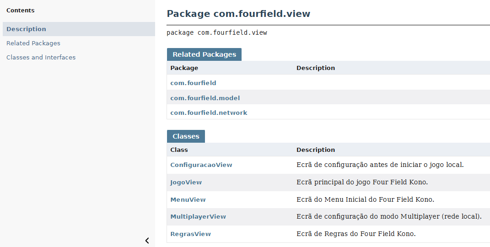
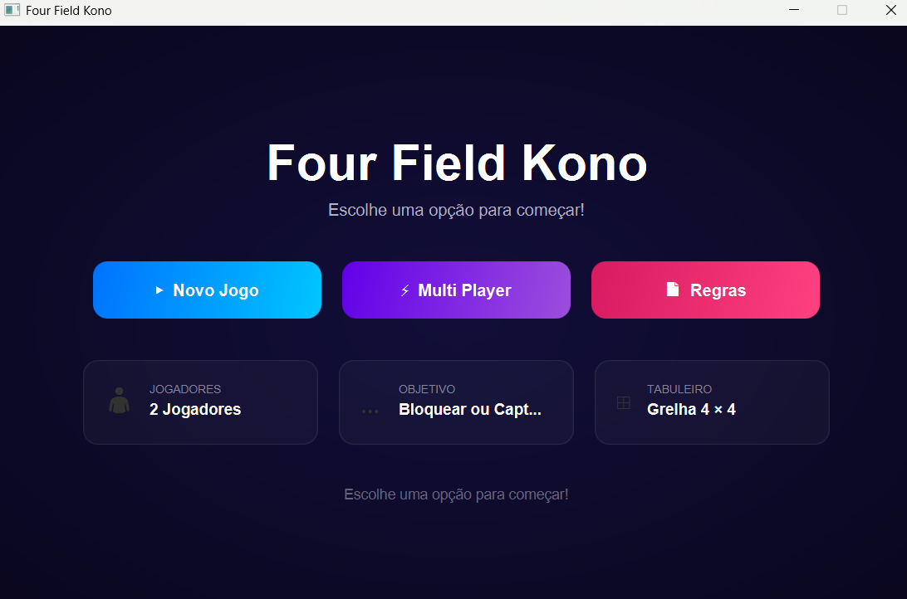

╔══════════════════════════════════╗
║         FOUR FIELD KONO          ║
╚══════════════════════════════════╝


# Four Field Kono — Java + JavaFX

Projeto desenvolvido em Java com JavaFX para a UC de Laboratório de Programação.  
Grupo: Bernardo Fernandes (25038) | Bento Silva (28844)

---

## Pré-requisitos

| Ferramenta | Versão mínima | Download |

| JDK | 17+ | https://adoptium.net |
| Maven | 3.8+ | https://maven.apache.org |
| VS Code | qualquer | https://code.visualstudio.com |
| Extension Pack Java | — | Marketplace do VS Code |

Para fazer-mos o run da app tivemos que instalar um extensão do Marketplace, extensão essa referida em cima.
---

## Por escolha propria usamos o IDE VS Code

1. Abre o VS Code
2. **File → Open Folder** → seleciona a pasta `FourFieldKono`
3. O VS Code deteta automaticamente o projeto Maven (O Maven é uma ferramenta de gestão de projetos Java que gere dependencias, compila e corre o projeto) e instala o JavaFX
4. Aguardar a build inicial

**NOTA**: se o projeto for aberto no vs pode ter alguns erros de compilação, não afeta a execução do programa.
---

## Para Correr o projeto

### Opção A — Botão Play no VS Code (se a extenção estiver instalada)
- Abre `MainApp.java`
- Clica no botão **▶ Run** que aparece acima do método `main`

### Opção B — Terminal
```bash
cd FourFieldKono
mvn javafx:run
```

---

## Estrutura do Projeto

```
FourFieldKono/
├── pom.xml                          ← Configuração Maven + JavaFX
└── src/main/java/
    ├── module-info.java
    └── com/fourfield/
        ├── MainApp.java             ← Ponto de entrada
        ├── model/
        │   ├── Peca.java            ← Classe Peça
        │   ├── Jogador.java         ← Classe Jogador
        │   ├── Tabuleiro.java       ← Grelha 4x4
        │   └── CondicoesJogo.java   ← Lógica e regras do jogo
        ├── view/
        │   ├── MenuView.java        ← Menu inicial
        │   ├── ConfiguracaoView.java← Configurar nomes
        │   ├── JogoView.java        ← Tabuleiro gráfico
        │   ├── RegrasView.java      ← Ecrã de regras
        │   └── MultiplayerView.java ← Configuração rede
        └── network/
            ├── ServidorJogo.java    ← Servidor TCP
            └── ClienteJogo.java     ← Cliente TCP
```

---

## Funcionalidades implementadas e establecidas no relatorio

| Requisito | Estado |

| RF01 – Menu Inicial
| RF02 – Tabuleiro 4×4 
| RF03 – Movimentos ortogonal 
| RF04 – Validação do Movimentos 
| RF05 – Controlo de turnos 
| RF06 – Multiplayer (rede TCP) 
| RF07 – Condições de vitória 
| Terminar jogo antecipadamente 

---

## Modo Multiplayer

1. **Anfitrião** abre o jogo → Multi Player → seleciona "Criar Servidor" → define a porta → o ip já esta devidamente atribuido para facilitar a experiencia ao utilizador → Ligar

2. **Cliente** abre o jogo → Multi Player → seleciona "Ligar como Cliente" → insere o IP do anfitrião → Ligar

3. As jogadas são enviadas automaticamente por rede

---

## JavaDoc

Como pedido foi criado o documento javaDoc, para isso acontecer é nessesario escrever comentários especiais no código com /** ... */ assim o Javadoc consegue gerar automaticamente uma documentação HTML.
No fim basta executar:
```bash
mvn javadoc:javadoc 
```
Este comando vai criar uma pasta docs\javadoc\. Para aceder ao conteudo basta aceder a esta pasta e abrir o index.html



---

## Ecrã Inicial

